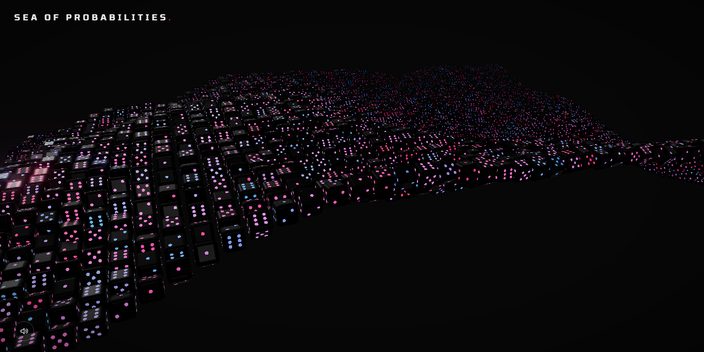

# Sea of Probabilities

An interactive field of dice rolling on a wave of probability. Move the cursor and click for the sea to respond. Everything is rendered live with [three.js](https://threejs.org/), and all the sound is synthesized in the browser with the Web Audio API — there are no audio files.



**Live:** https://anantaksingh.github.io/SeaOfProbabilities/

## Controls

Move the cursor, 
Click, 
Speaker button : Sound on / off 

Leave it alone for a few seconds and it plays by itself.

## Running it locally

Any static file server works:

```bash
python -m http.server 5178
```

Then open http://localhost:5178. three.js loads from a CDN, so you need an internet connection.

## License

MIT. See [LICENSE](LICENSE).

## Notes

This is the frontend build: the canvas, the title and the sound toggle. The development version has a full tweak panel (waves, ripples, lighting, post FX and every synth parameter) and is kept in a separate project.

Sound is synthesized: a detuned saw drone with faint static, a resonant neon pluck on hover, and on click a kick, a gated supersaw pad in D natural minor, and a filtered noise sweep, through a ping-pong delay and a convolution-style reverb.
